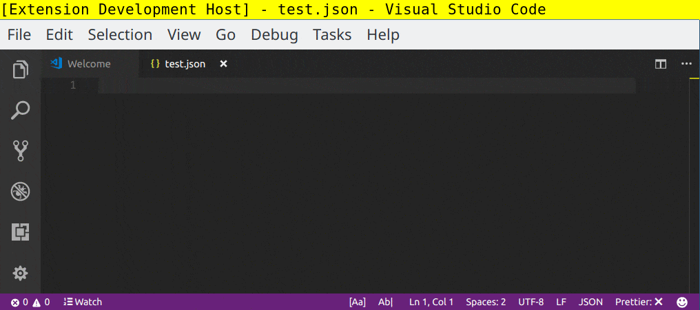
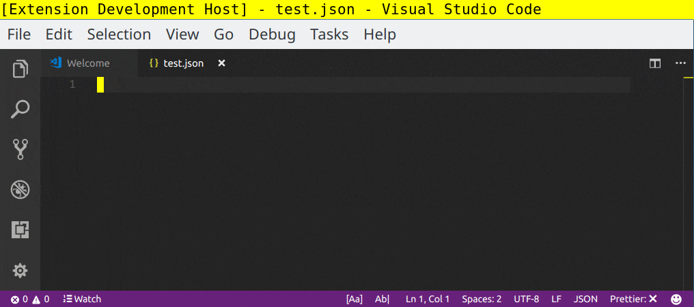

# fix-json

`fix-json` uses [jsonic](https://github.com/rjrodger/jsonic) to parse json data
in the current editor, then reformats the content using a simple
`JSON.stringify` call.

You can enter JSON data using the
[relaxed rules](https://github.com/rjrodger/jsonic#user-content-relaxed-rules)
supported by jsonic. For instance, quotes around property names and many string
values are not required. This makes it much easier to type JSON, or to convert
JavaScript objects into valid JSON.

## Features

Simply run the `Fix JSON` command in VS Code to fix either the selected content
in the current file, or the complete file if there is no selection.

### Error detection

If errors are encountered during the process of parsing your existing content,
they will be visualized in the editor.

### Indentation

The extension indents the generated JSON using a default number of spaces as
configured in your `editor.tabSize` setting. You can use the setting
`fixJson.indentationSpaces` to override the number specifically for this
extension.

No effort is made to provide formatting beyond the standard output from
`JSON.stringify(text, null, indentation)`. I recommend using
[Prettier](https://marketplace.visualstudio.com/items?itemName=esbenp.prettier-vscode).

## Extension Settings

This extension contributes the following settings:

* `fixJson.indentationSpaces`: Number of spaces to use for indentation of
  formatted JSON output. If not set, your editor.tabSize setting is used.

## Release Notes

### 0.1.2

Initial release of fix-json.
