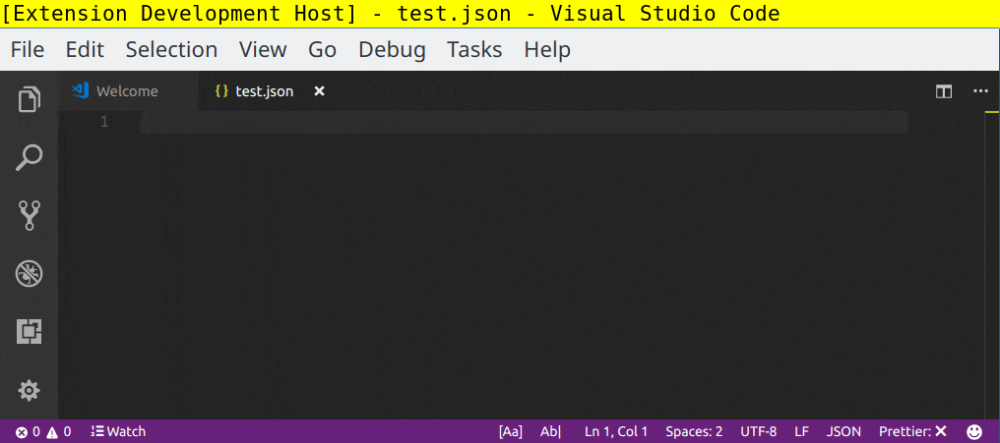
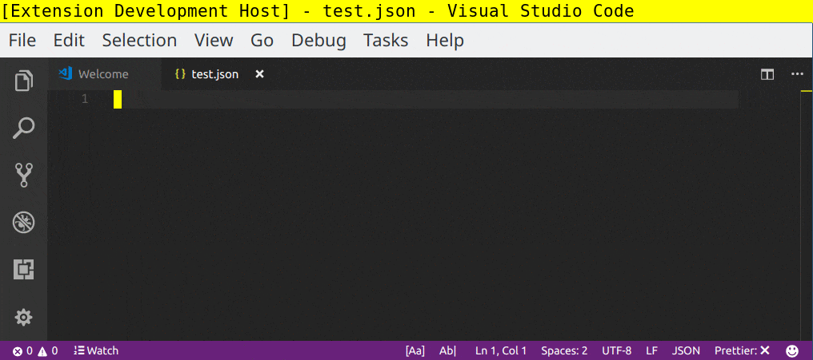

# fix-json

`fix-json` uses [jsonic](https://github.com/rjrodger/jsonic) to parse JSON data
in the current editor, then reformats the content using `JSON.stringify`.

You can enter JSON data using the
[relaxed rules](https://github.com/rjrodger/jsonic#user-content-relaxed-rules)
supported by jsonic. For instance, quotes around property names and many string
values are not required. This makes it much easier to type JSON, or to convert
JavaScript objects into valid JSON.

## Features

- **Fix JSON command**: Run the `Fix JSON` command to fix either the selected
  content in the active editor or the whole document if there is no selection.
- **Format Document integration**: Use the standard VS Code "Format Document"
  action on JSON files to apply the same fixing/formatting logic.

### Error detection

If errors are encountered during parsing, they are shown as editor diagnostics
(squiggles) with a message in the status bar.

### Indentation

The extension indents the generated JSON using a default number of spaces as
configured in your `editor.tabSize` setting. You can use the setting
`fixJson.indentationSpaces` to override the number specifically for this
extension.

No effort is made to provide formatting beyond the standard output from
`JSON.stringify(text, null, indentation)`. I recommend using
[Prettier](https://marketplace.visualstudio.com/items?itemName=esbenp.prettier-vscode).

### Notes

- Currently this extension targets JSON only. JSON with comments (JSONC) is not
  supported by the parser in use at this time.

## Installation

- VS Marketplace: https://marketplace.visualstudio.com/items?itemName=oliversturm.fix-json
- Open VSX: https://open-vsx.org/extension/oliversturm/fix-json
- Manual: Download a `.vsix` from the GitHub Releases page and install via the
  command palette (Extensions: Install from VSIX...).

## Usage

- Run the `Fix JSON` command from the Command Palette.
- Or use "Format Document" on a JSON file. On first use, select "Fix JSON" as
  the default formatter for JSON if prompted.

## Extension Settings

This extension contributes the following settings:

* `fixJson.indentationSpaces`: Number of spaces to use for indentation of
  formatted JSON output. If not set, your editor.tabSize setting is used.

## Development

- Run & debug: F5 (launches an Extension Development Host).
- Tests: `npm test` (Mocha unit tests of the core logic in `lib/fixText.js`).
- Lint: `npm run lint` (ESLint v9 flat config).
- Package: `npm run package` (produces a `.vsix`).

## CI/CD & Releases

- CI (`.github/workflows/ci.yml`) runs on pushes/PRs to the default branch:
  installs, lints, tests, and packages the extension; uploads the `.vsix` artifact.
- Releases (`.github/workflows/release.yml`) run on tags matching `v*.*.*` or via
  manual dispatch. Publish steps require repository secrets:
  - `VSCE_PAT` for VS Marketplace
  - `OVSX_PAT` for Open VSX

See `CHANGELOG.md` for notable changes.
